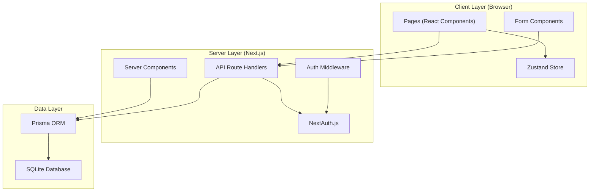
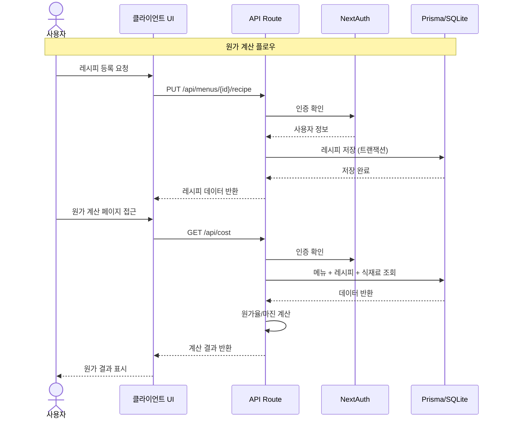

# System Architecture

## System Overview

푸드코스트는 Next.js 14 App Router 기반의 풀스택 웹 애플리케이션입니다. 서버 사이드와 클라이언트 사이드가 단일 프로젝트에 통합된 모놀리식 구조이며, SQLite를 통해 로컬 데이터를 관리합니다.

## Architecture Diagram

## Component Descriptions

### Next.js App Router (Application Framework)
- **Purpose**: 프론트엔드와 백엔드를 통합하는 풀스택 프레임워크
- **Responsibilities**: 라우팅, SSR, API 핸들링, 미들웨어
- **Dependencies**: React 18, NextAuth.js
- **Type**: Application

### Prisma ORM (Data Access)
- **Purpose**: 타입 안전한 데이터베이스 접근
- **Responsibilities**: 스키마 정의, 마이그레이션, CRUD 쿼리, 트랜잭션
- **Dependencies**: SQLite
- **Type**: Shared (Data Access Layer)

### NextAuth.js (Authentication)
- **Purpose**: 인증 및 세션 관리
- **Responsibilities**: Credentials/OAuth 인증, JWT 세션, 콜백 처리
- **Dependencies**: Prisma, bcryptjs
- **Type**: Shared (Security)

### Tailwind CSS + Lucide React (UI)
- **Purpose**: UI 스타일링 및 아이콘
- **Responsibilities**: 반응형 디자인, 컴포넌트 스타일링
- **Dependencies**: PostCSS
- **Type**: Client (Presentation)

### Recharts (Visualization)
- **Purpose**: 데이터 시각화 차트 렌더링
- **Responsibilities**: 라인차트, 바차트, 파이차트 렌더링
- **Dependencies**: React
- **Type**: Client (Presentation)

## Data Flow

## Integration Points

- **External APIs**: 없음 (자체 완결형 시스템)
- **Databases**: SQLite (file:./prisma/dev.db) - 로컬 파일 기반 DB
- **Third-party Services**:
  - Google OAuth (소셜 로그인)
  - Kakao OAuth (소셜 로그인)

## Infrastructure Components

- **CDK Stacks**: 없음 (로컬 개발 환경)
- **Deployment Model**: 단일 Next.js 서버 (로컬 개발 모드)
- **Networking**: 로컬호스트 (localhost:3000)
