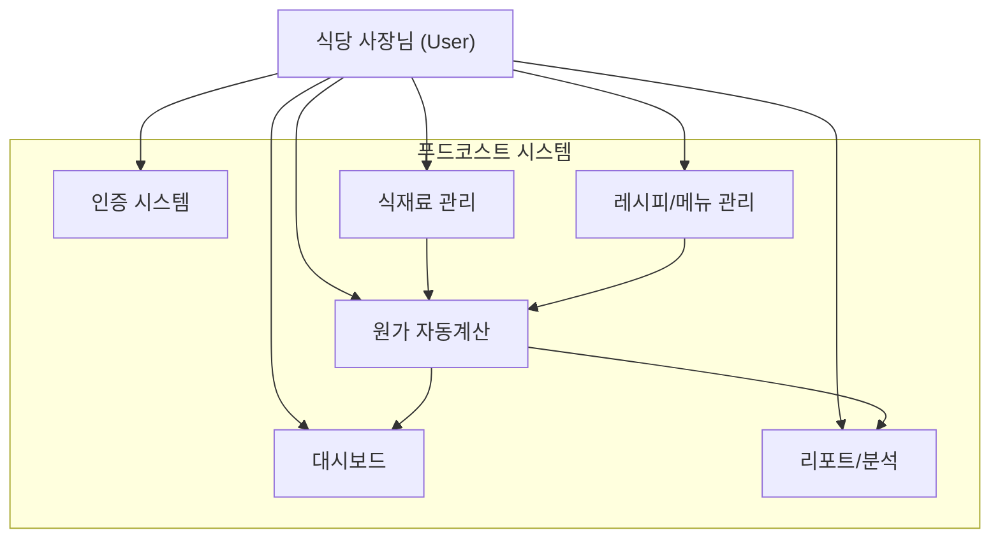

# Business Overview

## Business Context Diagram

## Business Description

- **Business Description**: 푸드코스트는 요식업 사장님들이 메뉴별 원가를 자동으로 계산하고 관리할 수 있는 웹 서비스입니다. 식재료 단가를 등록하고, 레시피에 사용되는 식재료와 용량을 입력하면 메뉴별 원가율, 마진, 위험도를 자동으로 산출합니다. 이를 통해 수익성을 시각적으로 파악하고, 원가율이 높은 메뉴를 사전에 감지하여 경영 의사결정을 지원합니다.

- **Business Transactions**:
  1. **사용자 가입/로그인**: 이메일 또는 소셜(Google, Kakao) 계정으로 회원가입하고 서비스에 접근
  2. **식재료 등록/관리**: 식재료명, 카테고리, 단위, 단가를 등록/수정/삭제하며 단가 변동 이력 자동 추적
  3. **메뉴 생성**: 메뉴명, 카테고리(한식/중식/일식/양식 등), 판매가격 설정
  4. **레시피 배합 등록**: 메뉴에 사용되는 식재료 조합과 용량을 지정하여 레시피 구성
  5. **원가 자동 계산**: 레시피 기반으로 메뉴별 총 원가, 원가율, 마진을 실시간 산출
  6. **대시보드 확인**: 전체 메뉴 수, 평균 원가율, 위험 메뉴 목록, 최근 수정 메뉴 한눈에 파악
  7. **리포트 분석**: 원가율 순위 차트, 식재료별 비용 비중 파이차트, 월별 단가 변동 추이 확인

- **Business Dictionary**:
  | 용어 | 의미 |
  |------|------|
  | 원가 (Cost) | 메뉴 1인분을 만드는데 들어가는 식재료 비용 합계 |
  | 원가율 (Cost Rate) | (원가 / 판매가) x 100. 30% 이하 양호, 30~40% 주의, 40% 초과 위험 |
  | 마진 (Margin) | 판매가 - 원가. 메뉴 1인분 판매 시 이익 |
  | 식재료 (Ingredient) | 요리에 사용되는 재료. 단가와 단위로 관리 |
  | 레시피 (Recipe) | 메뉴를 구성하는 식재료 배합 목록과 각 사용량 |
  | 메뉴 (Menu) | 판매하는 음식 항목. 카테고리와 판매가 포함 |
  | 단가 (Unit Price) | 식재료 1단위(g, mL, 개 등)당 가격 |
  | 단가 이력 (Price History) | 식재료 단가 변경 시 자동 기록되는 변동 이력 |

## Component Level Business Descriptions

### 인증 시스템 (Auth)
- **Purpose**: 사용자 식별 및 개인 데이터 보호
- **Responsibilities**: 회원가입, 로그인, 소셜 로그인(Google/Kakao), 세션 관리, 라우트 보호

### 식재료 관리 (Ingredient Management)
- **Purpose**: 원가 계산의 기초가 되는 식재료 마스터 데이터 관리
- **Responsibilities**: 식재료 CRUD, 검색/필터, 카테고리 분류, 단가 이력 자동 기록

### 레시피/메뉴 관리 (Recipe/Menu Management)
- **Purpose**: 메뉴에 들어가는 식재료 배합을 정의하여 원가 계산 기반 마련
- **Responsibilities**: 메뉴 CRUD, 레시피 편집(식재료 추가/삭제/수량 변경), 실시간 원가 미리보기

### 원가 계산 엔진 (Cost Calculator)
- **Purpose**: 레시피 기반으로 메뉴별 원가, 원가율, 마진을 자동 산출
- **Responsibilities**: 총 원가 합산, 원가율 계산, 위험도 판별 (양호/주의/위험)

### 대시보드 (Dashboard)
- **Purpose**: 경영 핵심 지표를 한눈에 제공
- **Responsibilities**: 통계 요약 카드 표시, 원가율 경고 메뉴 목록, 최근 수정 메뉴 표시

### 리포트 (Reports)
- **Purpose**: 심층적인 원가 분석 데이터를 차트로 시각화
- **Responsibilities**: 원가율 순위 바 차트, 식재료 비용 비중 파이차트, 월별 단가 변동 라인차트
