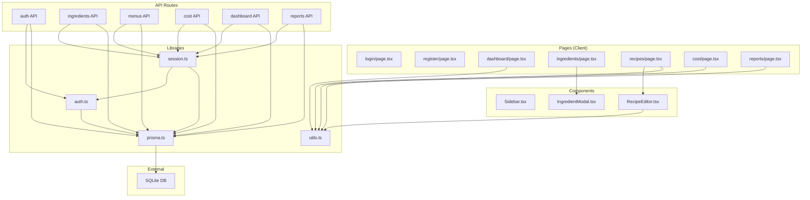

# Dependencies

## Internal Dependencies

## Internal Module Dependencies

### Pages depend on Components
- `ingredients/page.tsx` → `IngredientModal.tsx` (식재료 추가/수정 모달)
- `recipes/page.tsx` → `RecipeEditor.tsx` (레시피 편집 모달)

### Pages depend on Libraries
- `dashboard/page.tsx` → `utils.ts` (formatKRW, formatPercent, getCostRateLevel)
- `recipes/page.tsx` → `utils.ts` (formatKRW, formatPercent, getCostRateLevel)
- `cost/page.tsx` → `utils.ts` (formatKRW, formatPercent, getCostRateLevel)
- `reports/page.tsx` → `utils.ts` (formatKRW, formatPercent)
- `RecipeEditor.tsx` → `utils.ts` (formatKRW)

### API Routes depend on Libraries
- All API routes → `session.ts` (getCurrentUser)
- All API routes → `prisma.ts` (Prisma Client)
- `session.ts` → `auth.ts` (authOptions)
- `session.ts` → `prisma.ts` (Prisma Client)
- `auth.ts` → `prisma.ts` (Prisma Client)

### Layout depend on Libraries
- `(dashboard)/layout.tsx` → `auth.ts` (authOptions)
- `(dashboard)/layout.tsx` → `Sidebar.tsx` (component)

## External Dependencies (package.json)

### Production Dependencies
| 패키지 | 버전 | 용도 | 라이선스 |
|--------|------|------|----------|
| next | 14.2.35 | 풀스택 프레임워크 | MIT |
| react | ^18 | UI 렌더링 | MIT |
| react-dom | ^18 | DOM 렌더링 | MIT |
| @prisma/client | ^5.22.0 | ORM | Apache-2.0 |
| next-auth | ^4.24.11 | 인증 | ISC |
| recharts | ^2.15.0 | 차트 라이브러리 | MIT |
| zustand | ^4.5.5 | 상태 관리 | MIT |
| zod | ^3.24.1 | 스키마 검증 | MIT |
| bcryptjs | ^2.4.3 | 비밀번호 해싱 | MIT |
| lucide-react | ^0.468.0 | 아이콘 | ISC |

### Development Dependencies
| 패키지 | 버전 | 용도 | 라이선스 |
|--------|------|------|----------|
| typescript | ^5 | TypeScript 컴파일러 | Apache-2.0 |
| prisma | ^5.22.0 | Prisma CLI | Apache-2.0 |
| tailwindcss | ^3.4.1 | CSS 프레임워크 | MIT |
| postcss | ^8 | CSS 후처리 | MIT |
| eslint | ^8 | 코드 린팅 | MIT |
| eslint-config-next | 14.2.35 | Next.js ESLint 규칙 | MIT |
| tsx | ^4.23.0 | TypeScript 실행기 | MIT |
| @types/node | ^20 | Node.js 타입 | MIT |
| @types/react | ^18 | React 타입 | MIT |
| @types/react-dom | ^18 | React DOM 타입 | MIT |
| @types/bcryptjs | ^2.4.6 | bcryptjs 타입 | MIT |

## Dependency Notes
- 모든 의존성이 MIT 또는 Apache-2.0 라이선스로 상업적 사용 가능
- next-auth v4 사용 중 (v5 Auth.js로 마이그레이션 가능)
- Prisma v5 사용 중 (최신 안정 버전)
- React 18 기반 (React 19로 업그레이드 가능하나 next 14는 18 권장)
